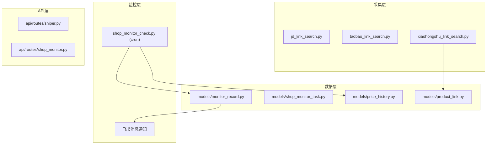

# Implementation Plan: Shop Monitor + Xiaohongshu Channel

## Scope

本次实现包含两个独立模块：

**模块 A - 小红书商品链接采集**：
- 新增 `scripts/xiaohongshu_link_search.py` 独立脚本
- 在前端"添加商品链接"弹窗中增加小红书渠道选项

**模块 B - 店铺监控**：
- 新增 `models/shop_monitor_task.py` 数据模型
- 新增 `scripts/shop_monitor_check.py` 定时检查脚本
- 新增 `api/routes/shop_monitor.py` 任务配置 CRUD API
- 前端新增店铺监控配置页面

## Technical Context

### 小红书页面特性

| 特性 | 说明 | 状态 |
|------|------|------|
| 渲染方式 | React CSR，需 Playwright 等待加载 | NEEDS CLARIFICATION |
| 搜索 URL | `https://www.xiaohongshu.com/search_result?keyword={keyword}&source=web_explore_feed` | 已知 |
| 商品卡片结构 | `.note-card .cover[nail]`，链接在 `a[href^="/discovery/item"]` | NEEDS CLARIFICATION |
| 反爬机制 | 限流+验证码，请求频率过高时触发 | NEEDS CLARIFICATION |

### 店铺监控页面

| 平台 | 监控方式 | 状态 |
|------|----------|------|
| 淘宝店铺 | 页面快照对比，检测新品区块变化 | NEEDS CLARIFICATION |
| 天猫店铺 | 页面快照对比，店铺上新区块 | NEEDS CLARIFICATION |
| 京东店铺 | 页面快照对比，店铺新品区块 | NEEDS CLARIFICATION |
| 小红书店铺 | 搜索店铺主页，提取商品列表 | NEEDS CLARIFICATION |

### 现有基础设施

- Playwright + AgentBay 浏览器自动化框架已就绪
- 飞书消息通知能力已有 (`lark-im` skill)
- 任务调度使用 `scripts/` + cron 触发
- 现有 `scripts/jd_link_search.py` 可作为新脚本的结构参考

## Architecture



## Proposed Files

### `scripts/xiaohongshu_link_search.py`

独立搜索脚本，结构参考 `jd_link_search.py`：

```python
# 主要逻辑
- 构建搜索 URL（含 keyword）
- 使用 Playwright 加载页面，等待 `.note-card` 渲染
- 提取商品卡片：标题、URL、店铺名、价格（可见时）
- 分页：点击"下一页"按钮（最多 5 页）
- 输出：商品链接列表（含 title, url, shop, price）
```

### `models/shop_monitor_task.py`

数据模型：

```python
# 字段
id: int (PK)
name: str  # 任务名称
shop_url: str  # 店铺主页 URL
platform: str  # 淘宝/天猫/京东/小红书
monitor_types: list[str]  # ["price", "stock", "new_arrival"]
frequency: str  # daily/weekly
is_enabled: bool
created_at, updated_at: datetime

# 关联
MonitorRecord (1:N)
PriceHistory (1:N)
```

### `models/monitor_record.py`

```python
# 字段
id: int
task_id: int (FK)
product_url: str
product_title: str
price: Decimal/NULL
is_new: bool
detected_at: datetime
```

### `models/price_history.py`

```python
# 字段
id: int
product_url: str (indexed)
price: Decimal
recorded_at: datetime
```

### `api/routes/shop_monitor.py`

CRUD endpoints:

| Method | Path | Description |
|--------|------|-------------|
| GET | /api/shop-monitors | 列表 |
| POST | /api/shop-monitors | 创建任务 |
| PUT | /api/shop-monitors/{id} | 更新任务 |
| DELETE | /api/shop-monitors/{id} | 删除任务 |
| GET | /api/shop-monitors/{id}/records | 监控记录 |
| GET | /api/shop-monitors/{id}/price-history | 价格历史 |
| POST | /api/shop-monitors/{id}/export | 导出 CSV |

### `scripts/shop_monitor_check.py`

定时检查脚本（由 cron 触发）：

```python
# 逻辑
- 查询所有 is_enabled=True 的 ShopMonitorTask
- 对每个任务：
  1. 加载店铺页面（Playwright）
  2. 检测监控类型：
     - new_arrival: 对比历史商品列表，新增则记录 + 发飞书告警
     - price: 检测价格变化，记录到 PriceHistory
     - stock: 检测库存状态（如果有）
  3. 更新 MonitorRecord
```

### `scripts/shop_monitor_run.py`

CLI 入口，用于手动触发或 cron：

```bash
poetry run python -m scripts.shop_monitor_run --task-id 123
poetry run python -m scripts.shop_monitor_run --all
```

## Agent Context Update

需要更新 agent 上下文的文件：
- `.claude/commands/` （如果存在自定义命令）
- 暂无特定 agent-context 文件需更新

## Constitution Check

| 条款 | 验证 | 状态 |
|------|------|------|
| Hybrid 模式 | 所有脚本使用 `page.evaluate()` + `agent.act()` | PASS |
| Context 管理 | 小红书需独立 Context（cookie 登录状态） | PASS |
| 错误处理 | 页面解析失败时有 fallback 和日志 | PASS |

## 阶段划分

### Phase 1: 小红书链接采集（优先）

1. 验证小红书页面结构（编写测试脚本）
2. 实现 `xiaohongshu_link_search.py`
3. 集成到前端添加链接弹窗

### Phase 2: 店铺监控数据模型

1. 设计并创建 `shop_monitor_task`、`monitor_record`、`price_history` 模型
2. 实现 `shop_monitor.py` API CRUD
3. 数据库迁移

### Phase 3: 店铺监控执行层

1. 实现 `shop_monitor_check.py` 检测逻辑
2. 实现上新检测（快照对比）
3. 接入飞书告警通知
4. 前端店铺监控页面

## Open Questions (设计时决策)

| # | 问题 | 建议选项 |
|---|------|----------|
| OQ-1 | 价格检查频率 | 每日（默认） |
| OQ-2 | 小红书重试策略 | 失败后等待 5s 重试 2 次，共 3 次 |
| OQ-3 | 新品定义 | 页面快照首次出现为标准（简化实现） |

## Dependencies

- Playwright 浏览器环境（已有）
- 飞书消息通知（`lark-im` skill，已验证）
- 数据库迁移工具（已有）

## Risks

| 风险 | 影响 | 缓解 |
|------|------|------|
| 小红书反爬严格 | 采集失败率高 | 增加 user-agent、降低请求频率、失败重试 |
| 页面结构变更 | 解析失效 | 监控解析异常，快速响应修复 |
| 店铺 URL 失效 | 监控中断 | 检测页面 404，及时通知用户 |