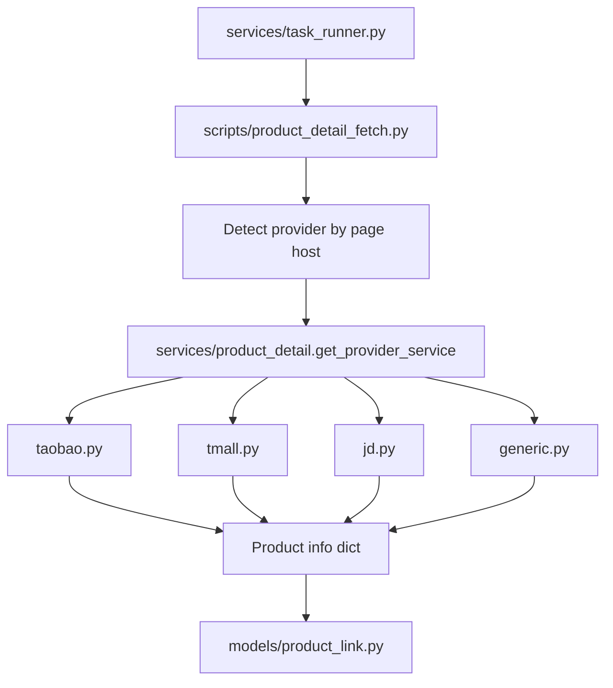

# Implementation Plan: 商品详情 Provider Service 分层

## Scope

本次重构只处理完整商品详情抓取路径：

- 保留 `scripts/product_detail_fetch.py` 作为任务编排入口。
- 新增 `services/product_detail/` 承载 provider-specific 页面提取策略。
- 迁移淘宝、天猫、京东、generic 的详情提取 JS 和滚动后详情图提取 JS。
- 不改 API、任务类型、模型、前端和调度器。

## Architecture



## Proposed Files

### `services/product_detail/base.py`

定义轻量接口：

```python
class ProductDetailService:
    platform = "generic"
    detail_js = ""
    detail_images_js = ""

    async def extract(self, page) -> dict[str, Any]:
        return await page.evaluate(self.detail_js)

    async def extract_detail_images(self, page) -> list[str]:
        return await page.evaluate(self.detail_images_js)
```

`base.py` 还可以提供共享的 `DETAIL_IMAGES_JS` 作为默认详情图补采逻辑。

### `services/product_detail/taobao.py`

迁移当前 `_TAOBAO_DETAIL_JS`，保留新版淘宝页的 `window.__ICE_APP_CONTEXT__` 优先提取逻辑。

### `services/product_detail/tmall.py`

迁移当前 `_TMALL_DETAIL_JS`，保留新版天猫页的 `window.__ICE_APP_CONTEXT__` 优先提取逻辑。

### `services/product_detail/jd.py`

迁移当前 `_JD_DETAIL_JS`。京东暂不扩展行为，只保持现有能力。

### `services/product_detail/generic.py`

迁移当前 `_GENERIC_DETAIL_JS`，作为未知 provider 兜底。

### `services/product_detail/__init__.py`

提供工厂方法：

```python
def get_provider_service(platform: str) -> ProductDetailService:
    return _PROVIDERS.get(platform, GenericProductDetailService)()
```

## Script Changes

`scripts/product_detail_fetch.py` 保留以下职责：

- 解析任务参数和 CLI 参数
- 创建 AgentBay session
- 连接 Playwright CDP
- 打开商品 URL
- 关闭弹窗
- 检测 provider
- 调用 provider service 提取信息
- 滚动并补采详情图
- 更新或创建 ProductLink
- 输出任务统计

核心调用改为：

```python
service = get_provider_service(platform)
info = await service.extract(page)
...
detail_imgs = await service.extract_detail_images(page)
```

## Compatibility

- `run_product_detail_fetch(task, ctx)` 签名不变。
- standalone 命令不变。
- ProductLink 写入字段不变。
- 任务结果统计结构不变。
- `services/task_runner.py` 不变。

## Validation Plan

1. 静态检查：
   - `ReadLints` 检查 `scripts/product_detail_fetch.py` 和新增 service 文件。

2. 真实链接复测：
   - 淘宝：
     `poetry run python -m scripts.product_detail_fetch --urls "https://item.taobao.com/item.htm?id=739198382798" --context-key "taobao-context:default:67e9bebf-8b7f-484b-9fbb-003395453f73" --output "/tmp/taobao_product_739198382798_after_refactor.json"`
   - 天猫：
     `poetry run python -m scripts.product_detail_fetch --urls "https://detail.tmall.com/item.htm?id=922333886401" --context-key "taobao-context:default:67e9bebf-8b7f-484b-9fbb-003395453f73" --output "/tmp/tmall_product_922333886401_after_refactor.json"`

3. 输出检查：
   - 淘宝标题不应为“参数”，价格应非空。
   - 天猫标题不应为“券后”，价格应非空。
   - `platform` 字段分别为 `taobao`、`tmall`。

## Risk Notes

- 迁移 JS 字符串时最容易出错的是 Python 三引号和 JavaScript 模板字符串，需要保持原内容完整。
- 淘宝和天猫逻辑目前高度相似，但先不抽公共 JS，避免在刚修好的逻辑上引入过度抽象。
- `search_by_urls.py` 仍有另一套简略 provider JS，本次不合并，后续可以在完整详情 service 稳定后再统一。
